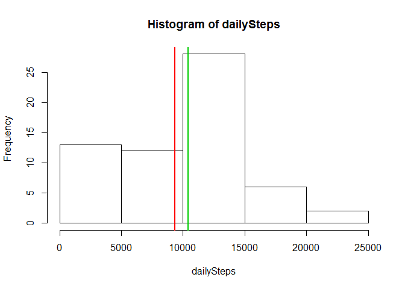
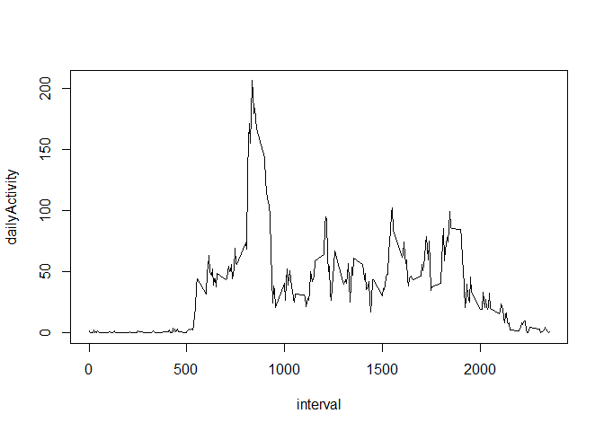
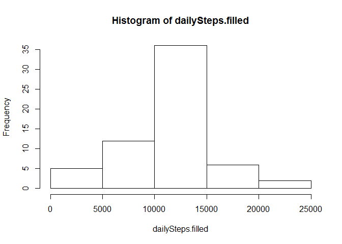
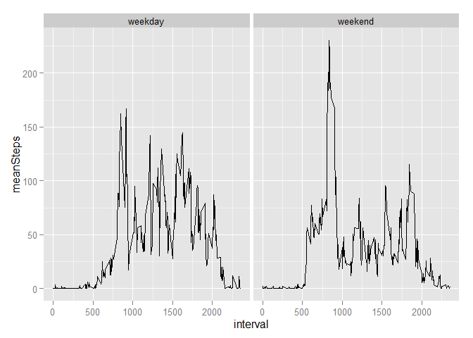

# Reproducible Research: Peer Assessment 1


## Loading and preprocessing the data

```r
data <- read.csv("activity.csv",header=TRUE)
```

## What is mean total number of steps taken per day?
Grouping the data by the date vector and calculating the sum of all steps for each group with tapply. NA values are ignored.

```r
dailySteps <- tapply(data$steps,data$date,sum,na.rm=TRUE)
hist(dailySteps)
mean<-mean(dailySteps)
median<-median(dailySteps)
abline(v=c(mean,median),col=2:3,lwd=2)
```

 

```r
mean
```

```
## [1] 9354.23
```

```r
median
```

```
## [1] 10395
```

The <span style="color:red">mean</span> of the total number of steps taken per day is 
<span style="color:red">9354.2295082</span> and the <span style="color:green">median 10395</span>.

## What is the average daily activity pattern?
Grouping the data by the interval vector and calculating the mean of all steps for each group with tapply. NA values are ignored.

```r
dailyActivity <-tapply(data$steps,data$interval,mean,na.rm=TRUE)
plot(names(dailyActivity),dailyActivity,type="l",xlab="interval")
```

 

```r
maxInterval <- names(which(dailyActivity==max(dailyActivity)))
maxInterval
```

```
## [1] "835"
```
The maximum number of steps is containing in the 835 interval.

## Imputing missing values

```r
missing<-sum(is.na(data$steps))
missing
```

```
## [1] 2304
```

The dataset contains 2304 missing values.

Filling in all of the missing values in the dataset by using the mean for the respective 5-minute interval.

```r
data.filled=data
for (i in which(is.na(data$steps))) data.filled$steps[i]=dailyActivity[names(dailyActivity)==data.filled$interval[i]]

dailySteps.filled <- tapply(data.filled$steps,data.filled$date,sum)
hist(dailySteps.filled)
```

 

```r
mean.filled<-mean(dailySteps.filled)
median.filled<-median(dailySteps.filled)
mean.filled
```

```
## [1] 10766.19
```

```r
median.filled
```

```
## [1] 10766.19
```
The mean of the total number of steps taken per day is 1.0766189\times 10^{4} and the median 1.0766189\times 10^{4}. In the filled in dataset the median and the mean is increased with respect to the dataset with NA values. Due to the filling-in-process by using the mean of the respective 5-minute interval the dataset is getting normal distribution so that the mean and the medium are becoming equal.


## Are there differences in activity patterns between weekdays and weekends?
Creating a new factor variable in the dataset with two levels - "weekday" and "weekend" indicating whether a given date is a weekday or weekend day.

```r
w=rep(FALSE,nrow(data))
w[which(as.POSIXlt(data.filled$date)$wday %in% 1:5)]=TRUE
wday<-factor(w,labels=c("weekday","weekend"))
data.filled=cbind(data.filled,wday)
```

Grouping the data by the interval vector and the wday vecvtor and calculating the mean of all steps for each group with tapply. 

```r
wdayActivity <-tapply(data.filled$steps,list(data.filled$interval,data.filled$wday),mean)
```
Reshape the data to a data.frame using the function melt from the respahe2 package and giving new variable names.

```r
library(reshape2)
wdayActivity<-melt(wdayActivity)
names(wdayActivity)<- c("interval","wday","meanSteps")
```

Plotting the time series of the activity for weekdays and weekends using the ggplot2 plotting system. 

```r
library(ggplot2)
qplot(interval,meanSteps,data=wdayActivity,facets=.~wday,geom="line")
```

 

